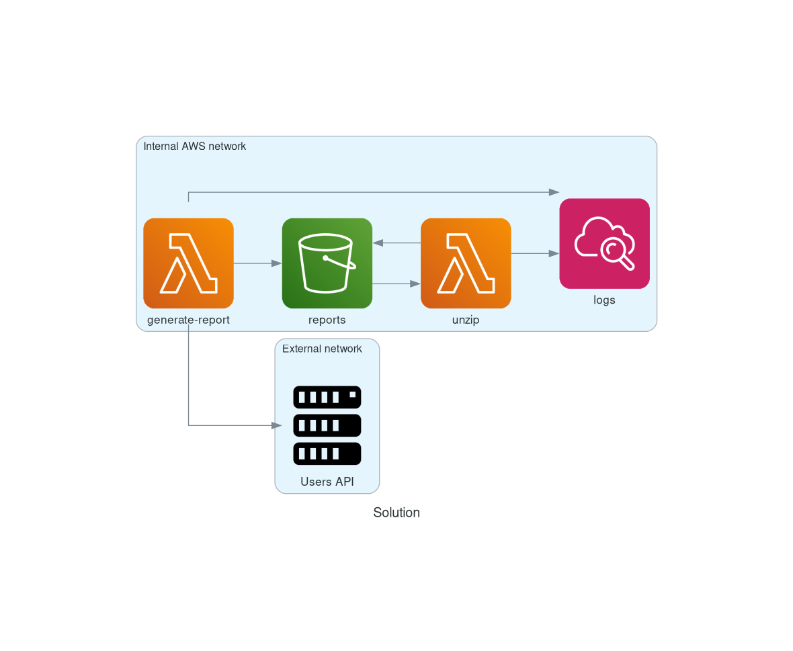

# Simple Go Lambda Scaffold

A simple project template designed to help developers build AWS Lambda functions using Go. This scaffold supports local development and testing using **LocalStack** with Docker to simulate the Lambda environment before deployment.

## Architecture Diagram



## Project Structure

We follow a community-standard folder structure for Go projects:

```text
.
├── cmd          # Main applications for the project
├── configs      # Configuration files
├── doc          # Documentation files
├── infra        # Terraform files for deploying to LocalStack
├── internal     # Private application and library code
├── pkg          # Public packages for external use
├── test         # Test files
└── .env.example # Example environment variables file
```

## Prerequisites

- [Docker and Docker Compose](https://docs.docker.com)
- [Go 1.23.2](https://golang.org)
- [Make (to use the provided Makefile)](https://www.gnu.org/software/make/)

## Getting Started

To prepare your local environment, run:

```bash
make prepare
# Or simply:
make
```

This command installs dependencies and sets up the local environment.

### Running a Lambda Function

To execute a specific Lambda function locally, use:

```bash
make run function=<name>
```

Replace `<name>` with the name of the function you want to run.

### Cleaning Up

To clean up the local environment, run:

```bash
make clean
```

## Makefile Automation

The project uses a Makefile to simplify development, build, and testing tasks, easing the CI/CD process. Some common commands include:

- make: Prepares the local environment.
- make run function=<name>: Runs a specific Lambda function.
- make test: Runs all tests.
- make build: Builds the Lambda function binaries.
- make clean: Cleans up the local environment.
- make help: Shows the available commands.

## Deployment with Terraform

Terraform files located under the infra/ folder allow you to deploy resources locally using LocalStack.

## Contributing

Contributions are welcome! Please see [CONTRIBUTING.md](CONTRIBUTING.md) for details on how to contribute.

## License

This project is licensed under the MIT License. See the [LICENSE](LICENSE) file for details.

---

Made with ❤️ by [David Vilaça](https://vilaca.dev)
